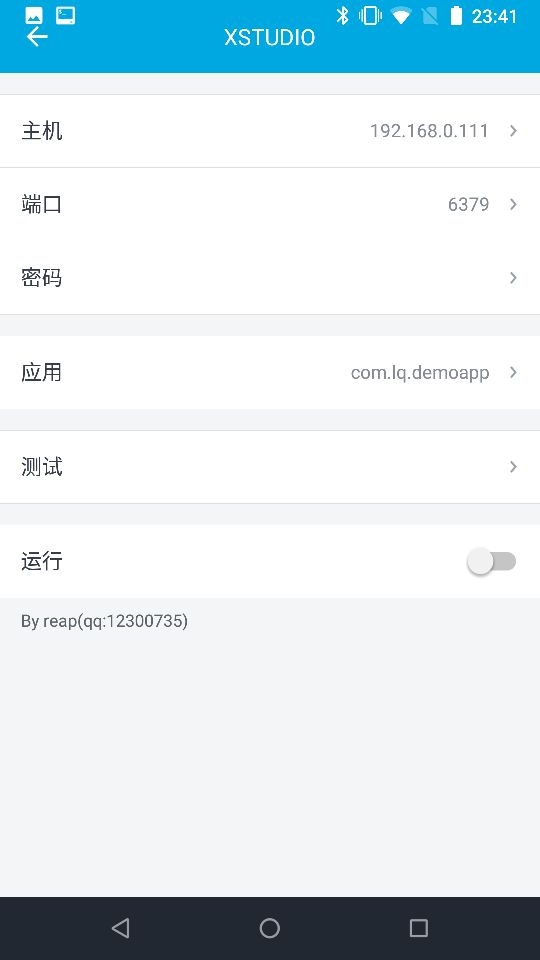
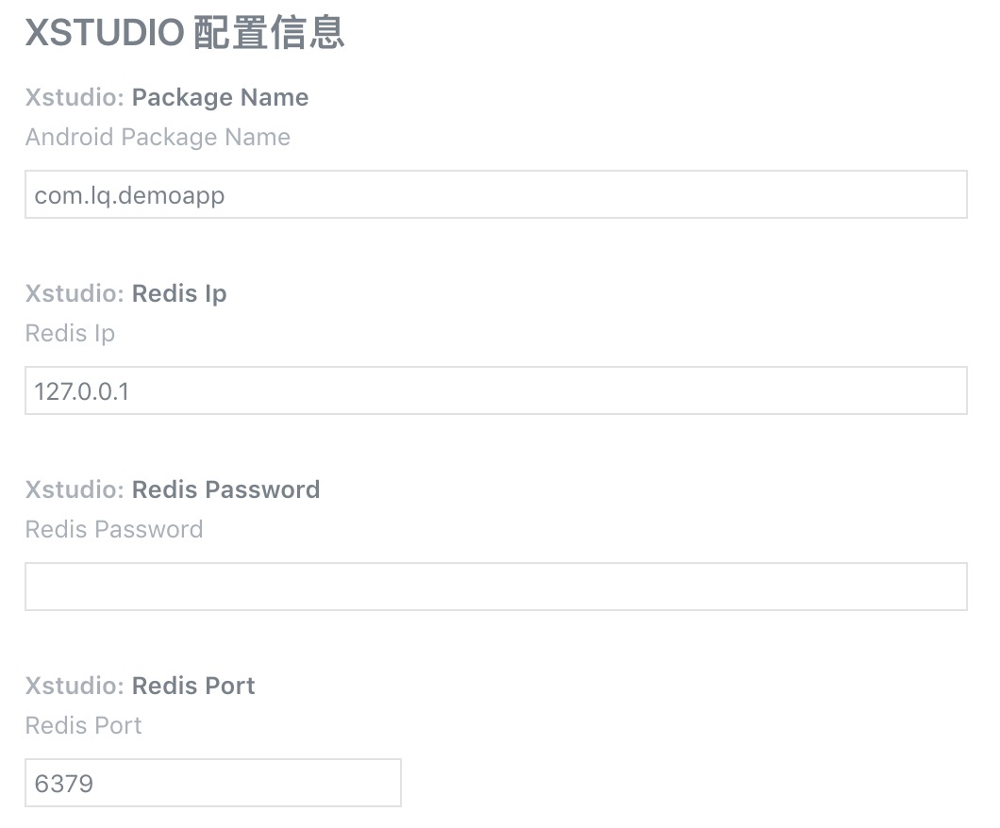
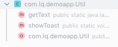
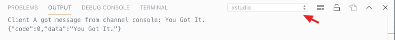

# xstudio-vs

这是一个基于xstudio的VSCode插件, 因为我一直使用Mac开发, xstudio只有win版, 因此开发了这个插件.

## 软件安装

----
1. 安装XP框架并激活, 方法自行搜索.

2. 安装XSTUDIO并激活

3. 在VSCode上安装xstudio-vs插件

4. 根据自己的操作系统下载Redis

## 配置说明

- Android端



- VSCode端

打开设置界面, 对Redis的Host和Port进行设置, 填写包名.



- Redis端

根据自己的需要进行配置, 为了测试方便, 我没有设置密码, 不建议这样做.

----

## 界面说明


## 使用说明

为了测试这个插件, 我简单写了一个[APP](./doc-img/app-release.apk), 以下所有的操作都是基于这个APP的. 

[注] 由于APP需要连接Redis, 因此申请了网络权限, 如果需要使用注入功能, 需要给APP读写文件的权限.

主要代码如下:
```java
public class Util {
    public static void showToast(Context context, String content) {
        Toast.makeText(context, content, Toast.LENGTH_LONG).show();
    }

    public static String getText() {
        return "You Got It.";
    }
}
```

- 反编译APP, 获取类路径

反编译方法请自行百度, 在测试APP中, 在这里路径是`com.lq.demoapp.Util`

- 利用搜索class功能获取详细的函数信息


- 点击查看搜索结果

搜索结果会缓存下来, 方便以后使用.



点击方法或属性, 可以快速得到代码.

- 执行测试 `getText`

复制如下代码到JS文件, 点击执行按钮, 在控制台便可以看到结果.

```javascript
// public static java.lang.String com.lq.demoapp.Util.getText()

//call
var ref = org.joor.Reflect
var main = function(lpparm, ctx, param) {
    
    var result = ref.on('com.lq.demoapp.Util', ctx.getClassLoader()).call('getText').get();
    console.log(result);
    return result;
}    
```



- 注入测试 `showToast`

```javascript
//hook
var find = function(lpparm, ctx, param) {
    var methods = org.joor.Reflect.on('com.lq.demoapp.Util', ctx.getClassLoader()).type().getDeclaredMethods();
    var func = 'showToast(android.content.Context,java.lang.String)';
    for (var i = 0; i < methods.length; i++) {
        if (methods[i].toString().contains(func)){
            return methods[i];
        }
    }
    return null;
}
var before_func = function(param) {
    console.log('before ->' + param.args[1]);
    param.args[1] = "UPDATED";
}

var after_func = function(param) {
    console.log('after ->' + param.args[1]);
}
```

注入需要选择文件, 在`js`文件上右键将此文件添加到待注入文件列表

然后选中需要注入的文件, 点击注入, 然后运行APP就可以看到结果了


## 使用的库和参考代码

1. xstudio         [[XSTUDIO] 吾爱破解](https://www.52pojie.cn/thread-937492-1-1.html?tdsourcetag=s_pcqq_aiomsg)
2. vscode          [Visual Studio Code](https://code.visualstudio.com/)
3. XposedInstaller [github](https://github.com/rovo89/XposedInstaller)
4. fastjson        [github](https://github.com/alibaba/fastjson)
5. jOOR            [github](https://github.com/jOOQ/jOOR)
6. rhino           [github](https://github.com/mozilla/rhino)
7. jedis           [github](https://github.com/xetorthio/jedis)
8. okhttp          [github](https://github.com/square/okhttp)
9. vscode-mysql    [github](https://github.com/mtxr/vscode-sqltools)


图标来源        [Iconfont-阿里巴巴矢量图标库](https://www.iconfont.cn/)

在这里感谢所有的作者.
